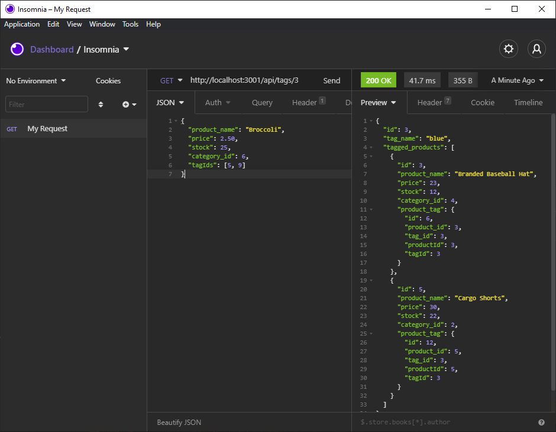

# ORM-E-Commerce_Back_End

---
## Descriptions
---

I created this app using mySQL2, Sequelize, and Express. The purpose for created the back-end functionality for this app was to allow an Internet Retial Company the ability to Create, Update, See and Remove Categories, Products, and Tags. This will allow them to compete with other e-commerce companies. They can do it without giving away their personal information because this app uses the dotenv npm package. Thus, their password and username is placed in a .env file rather than a public file. The app will connect to the local host at PORT 3001, and their mySQL database at 3306. 
## Repository
---
[Application Repository URL](https://github.com/cmcunningham27/ORM-E-Commerce_Back_End)
## Table of Contents
---
- [Installation](#installation)
- [Usage](#usage)
- [License](#license)
- [Complications](#complications)
- [Questions](#questions)
## Installation
---
1. Clone the repository in terminal
2. Run "npm i" in terminal
3. Find the .env file and enter your database's name, your mySQL username, and mySQL password.
4. Run "npm seeds/index.js" in terminal
5. Now you can run "npm start" in terminal and begin your requests
## Usage
---
[Demonstration Video POST, PUT, GET](https://drive.google.com/file/d/1zN1oGYyT6hbBvP8CRfaD3RE8ip3FDXOW/view)

[Demonstration Video Deleting](https://drive.google.com/file/d/1gsMfmtX7x7ORrnBZLZIWDIqGLBMry8JQ/view)

[Demonstration Video Single GET](https://drive.google.com/file/d/1QD_p9uGZVDycM3LZcDzU6v_tPHgRbfyC/view)

1. Once the app has begun go to your REST API Client (Insomnia or Postman) and start your requests.
2. Start with GET https://localhost:3001/api/categories to see all categories along with their Products.
3. You can see a specific category by entering the id for the category you wish to visit at the end like: GET https://localhost:3001/api/categories/5.
4. Follow steps 2 and 3 for products (place products in place of categories) or tags (place tags in place of categories).
5. To create a new category you must choose POST, https://localhost:3001/api/categories, type a JSON text below the POST request that includes the category_name key and value you wish to give it ( example: { "category_name": "Food" } ).
6. To create a new tag you must choose POST, https://localhost:3001/api/tags, type a JSON text below the POST request that includes the tag_name key and value you wish to give it ( example: { "tag_name": "Vegetable" } ).
7.To create a new product you must choose POST, https://localhost:3001/api/products, type a JSON text below the POST request that includes the product_name, price, stock, category_id, tag_id keys and values you wish to give it ( example: { "product_name": "Broccoli", "price": 1.50, "stock": 25, "category_id": 6, "tag_id": 5 } ).
8. To Update a category, product, or tag you will need to choose PUT, add the id associated with the one you want to change to the end of the url and enter all the necessary key/values from above: for category (https://localhost:3001/api/catogories/3), product (https://localhost:3001/api/products/6), tag (https://localhost:3001/api/tags/15).
9. To remove a category, product, or tag you will need to choose DELETE, include the associated id to the end of the url: for category (https://localhost:3001/api/catogories/3), product (https://localhost:3001/api/products/6), tag (https://localhost:3001/api/tags/15). 
## License
---
This project is licensed under the MIT license.

## Complications
---
I ran into moments where the request was not working properly, but I knew my code was correct. I used the console.log option when an error occured so I could be notified where the problem was coming from. I found that most of the time it was a single extra letter, or character.

When attempting to do a product POST it wasn't working. I took a closer look and that's when it became noticable that I was putting the actual table column name in (tag_id) instead of what the original code that was given was calling it (tagIds). Once I made this change the POST went through just fine. 

When doing the POST request for products I noticed that the example req.body was missing "category_id", so I included that to make sure the product was connected to a category.
## Questions
---
[GitHub Profile](https://github.com/cmcunningham27)

[E-mail](mailto:sttepstutoring@yahoo.com)

E-mailing me is the best option
